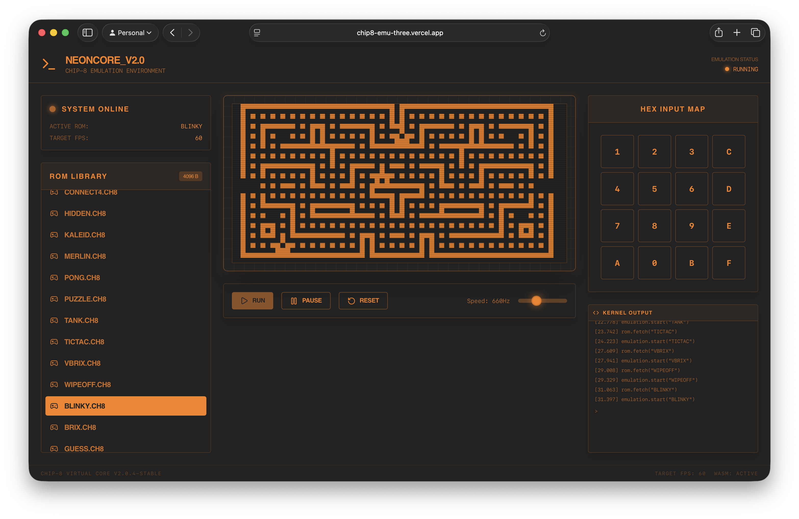

# CHIP-8 Emulator - NeonCore

A high-performance CHIP-8 emulator built with **C++** backend compiled to WebAssembly (WASM) and a modern **React** frontend with a retro-themed UI.

## Project Showcase


[chip8-emu-three.vercel.app](https://chip8-emu-three.vercel.app)

---

## About CHIP-8

CHIP-8 is an interpreted programming language from the mid-1970s. It's a simple 8-bit virtual machine that became popular for retro gaming and is still used today as a great introduction to emulation.

### CHIP-8 Specifications

-   **16 (8-bit) General Purpose Registers** (V0-VF, each 8-bit)
-   **4KB Memory** (0x200 - 0xFFF for programs)
-   **64x32 Pixel Display** (monochrome)
-   **16-Key Hexadecimal Keypad** (0x0-0xF)
-   **16-Level Stack** (for subroutine calls)
-   **8-bit Timers** (Delay and Sound timers)
-   **16-bit Program Counter**
-   **35 Instructions** (all 2 bytes)

### Classic CHIP-8 Games Included

The emulator comes pre-loaded with 23 classic games including:

-   **PONG** - The iconic arcade game
-   **TETRIS** - Block stacking puzzle game
-   **INVADERS** - Space shooter
-   **BREAKOUT** - Brick breaker game
-   **MAZE** - Maze navigation
-   And many more!

---

## Installation & Setup

### Quick Start

#### 1. Clone the Repository

```bash
git clone https://github.com/oyetanishq/chip8_emu.git
cd chip8_emu
```

#### 2. Install Website Dependencies

```bash
cd website
yarn install
```

#### 3. Run the Development Server

```bash
yarn run dev
```

The emulator will be available at `http://localhost:5173` (or the port shown in your terminal).

#### 4. Build for Production

```bash
yarn run build
```

### Building the WASM Core

If you want to rebuild the C++ core:

#### Prerequisites

-   Install [Emscripten](https://emscripten.org)
-   Ensure CMake is installed

#### Build Steps

```bash
cd chip8_core
mkdir -p build/wasm
cd build/wasm

emcmake cmake ../..
make

# The compiled WASM module will be generated in `build/wasm/chip8_wasm.js`.
```

### Building the chip8 core (desktop)

If you want to rebuild the C++ core:

#### Prerequisites

-   Ensure SDL2 is installed

#### Build Steps

```bash
cd chip8_core
mkdir -p build/core
cd build/core

cmake ../..
make

./chip8_core ../../roms/TANK
```

---

## Project Structure

```
chip8_emu/
├── chip8_core/                 # C++ emulator core
│   ├── src/
│   │   ├── chip8.cpp           # Main emulator implementation
│   │   ├── instructions.cpp    # Instruction set
│   │   ├── wasm_bindings.cpp   # WebAssembly bindings
│   │   └── main.cpp            # CLI entry point
│   ├── include/
│   │   └── chip8.hpp           # Public interface
│   ├── roms/                   # ROM files
│   └── CMakeLists.txt          # Build configuration
│
├── website/                    # React frontend
│   ├── src/
│   │   ├── pages/
│   │   │   └── home.tsx        # Main emulator interface
│   │   ├── lib/
│   │   │   └── chip8_wasm.js   # Compiled WASM module
│   │   └── global.css          # Theme and styles
│   ├── public/
│   │   └── roms/               # Game ROMs
│   └── package.json
│
└── docs/                       # Documentation
    └── image.png               # Project screenshot
```

---

## Usage

### Loading a Game

1. Open the emulator in your browser
2. Select a ROM from the **ROM Library** on the left panel
3. Click the **Run** button to start emulation
4. Use your keyboard or the on-screen keypad to play

### Keyboard Controls

The CHIP-8 hexadecimal keypad maps to your keyboard:

```
1 2 3 4  →  1 2 3 C
Q W E R  →  4 5 6 D
A S D F  →  7 8 9 E
Z X C V  →  A 0 B F
```

### Adjusting Game Speed

Use the **Speed** slider in the controls bar to adjust emulation speed:

-   Lower values = slower emulation (easier for slower games)
-   Higher values = faster emulation (up to 1800Hz)

---

## For Developers

### Building a Custom Version

1. Modify the C++ source in `chip8_core/src/`
2. Rebuild the WASM module using the steps above
3. Copy the generated `.js` files to `website/src/lib/`
4. Run `yarn build` to create the production bundle

### Adding New ROMs

1. Place ROM files in `website/public/roms/`
2. Add the ROM name to the `AVAILABLE_ROMS` array in `website/src/pages/home.tsx`
3. The emulator will automatically detect and list the ROM

---

**Enjoy the nostalgia! 🎮✨**
